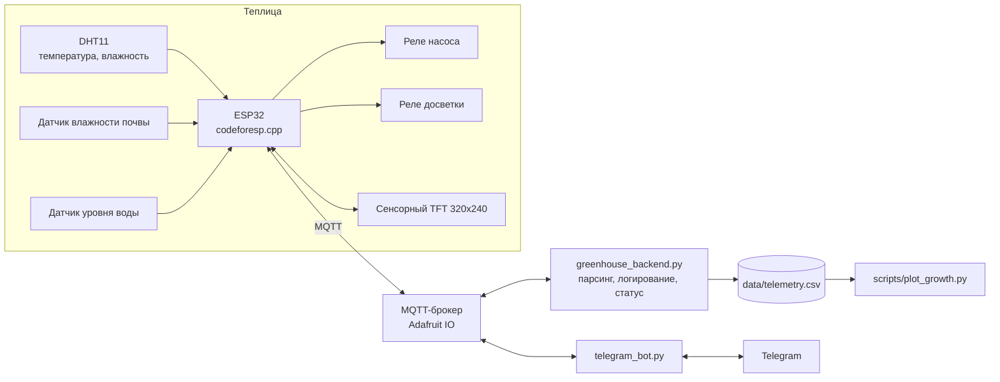

# Smart Greenhouse v2

Автоматизированная теплица на ESP32 с непрерывной записью условий среды.
Система удерживает влажность почвы и длину светового дня в заданных границах,
снимает показания каждые 2.5 секунды и ведёт полную историю измерений в CSV —
то есть работает не только как автополив, но и как измерительный прибор для
сравнительного агробиологического эксперимента.

Управление доступно с трёх сторон: сенсорный дисплей на самом устройстве,
Telegram-бот и MQTT-брокер. Методика эксперимента, гипотеза и схема групп —
в [`docs/scientific-rationale.md`](docs/scientific-rationale.md).

---

## Возможности

| | |
|---|---|
| **Автополив** | Насос включается по показаниям датчика влажности почвы с настраиваемым порогом (по умолчанию 30%) и блокируется при низком уровне воды в баке. |
| **Фотопериод** | Досветка управляется по расписанию реального времени (NTP), поддерживаются расписания через полночь. Период задаётся на лету командой `SET_PHOTOPERIOD`. |
| **Непрерывная телеметрия** | Каждая точка измерений пишется в `data/telemetry.csv`: время, влажность почвы, температура, влажность воздуха, состояние насоса и досветки. |
| **Локальный интерфейс** | TFT-дисплей с тремя вкладками: дашборд показаний, управление камерой, системная консоль с экранной клавиатурой. |
| **Удалённый доступ** | Telegram-бот: телеметрия, снимок с камеры, ручное управление насосом и светом, отправка консольных команд. |
| **Построение графиков** | `scripts/plot_growth.py` строит динамику параметров с выделением периодов досветки. |

---

## Архитектура



Устройство остаётся автономным: полив и свет работают по локальной логике
даже при обрыве связи. MQTT нужен для передачи телеметрии наружу и приёма
команд, но не является условием работы теплицы.

---

## Аппаратная часть

| Компонент | Подключение | Назначение |
|---|---|---|
| ESP32 | — | Основной контроллер |
| DHT11 | GPIO 22 | Температура и влажность воздуха |
| Датчик влажности почвы | GPIO 34 (ADC) | Влажность субстрата |
| Датчик уровня воды | GPIO 27 | Защита насоса от сухого хода |
| Реле насоса | GPIO 25 | Полив |
| Реле досветки | GPIO 26 | Фотопериод |
| TFT-дисплей с тачскрином | SPI, настройка в `TFT_eSPI` | Локальный интерфейс |
| ESP32-CAM | отдельный модуль по HTTP | Снимки и видеопоток (опционально) |

Калибровка датчика почвы задаётся константами `DRY_VAL` и `WET_VAL` в
`codeforesp.cpp`: сырые значения АЦП для сухого и влажного субстрата.
Значения зависят от конкретного датчика и грунта, поэтому снимаются
экспериментально перед началом опыта.

---

## Структура репозитория

```
codeforesp.cpp          Прошивка ESP32: датчики, реле, дисплей, MQTT, фотопериод
config.h.example        Шаблон секретов прошивки (WiFi, MQTT)
greenhouse_backend.py   MQTT-сервер: приём телеметрии, запись CSV, отчёты о статусе
telegram_bot.py         Telegram-бот: телеметрия, управление, камера
scripts/plot_growth.py  Построение графиков по собранной телеметрии
docs/                   Методика эксперимента и шаблон биометрических измерений
data/                   История измерений (CSV, не отслеживается git)
requirements.txt        Зависимости Python
.env.example            Шаблон переменных окружения
```

---

## Установка

### Прошивка

Требуются библиотеки: `WiFi`, `PubSubClient`, `ESPAsyncWebServer`,
`ArduinoJson`, `TFT_eSPI`, `DHT sensor library`, `HTTPClient`.

```bash
cp config.h.example config.h
```

Заполнить `config.h` данными сети и MQTT, затем прошить плату через Arduino
IDE или PlatformIO. Часовой пояс задаётся константой `GMT_OFFSET_SEC`
(по умолчанию UTC+5).

### Backend и бот

```bash
python3 -m venv .venv && source .venv/bin/activate
pip install -r requirements.txt
cp .env.example .env
```

Заполнить `.env`, экспортировать переменные и запустить:

```bash
python greenhouse_backend.py     # приём телеметрии и запись истории
python telegram_bot.py           # удалённое управление
```

`data/telemetry.csv` создаётся автоматически при первом полученном сообщении.

---

## Протокол обмена

Телеметрия, топик `<owner>/feeds/smartgarden_data`:

```
soil_pct,temp_c,humidity_pct,pump_on,light_on
```

Команды, топик `<owner>/feeds/smartgarden_control`:

| Команда | Действие |
|---|---|
| `PUMP_ON` / `PUMP_OFF` | Ручное управление насосом |
| `LIGHT_ON` / `LIGHT_OFF` | Ручное управление досветкой, отключает расписание |
| `LIGHT_AUTO` | Возврат к расписанию фотопериода |
| `SET_PHOTOPERIOD:6-22` | Установка светового дня (часы включения и выключения) |
| `GET_STATUS` | Запрос текстового отчёта о состоянии |
| `CMD:<текст>` | Произвольная команда с консоли устройства |
| `CLEAR_CHAT` | Очистка журнала на дисплее |

---

## Формат данных

`data/telemetry.csv`:

| Поле | Описание |
|---|---|
| `timestamp` | Время записи в формате ISO 8601 |
| `soil_pct` | Влажность почвы, 0–100 (условная шкала по калибровке) |
| `temp_c` | Температура воздуха, °C |
| `humidity_pct` | Влажность воздуха, % |
| `pump_on` | Состояние насоса, 0 или 1 |
| `light_on` | Состояние досветки, 0 или 1 |

Построение графика по собранным данным:

```bash
python scripts/plot_growth.py --csv data/telemetry.csv --out growth_chart.png
```

Верхняя панель графика — влажность почвы с отмеченным порогом полива,
нижняя — температура и влажность воздуха с закрашенными периодами досветки.

---

## Конфигурация и доступ

`config.h` и `.env` содержат пароль от сети и ключи MQTT и исключены из
репозитория через `.gitignore`; отслеживаются только шаблоны с
плейсхолдерами. Telegram-бот ограничивает доступ списком `ALLOWED_USERS`,
при пустом списке отвечает всем.

---

## Известные ограничения

- DHT11 даёт точность ±2 °C и ±5% влажности; для более точных измерений
  подходят DHT22 или SHT31.
- Освещённость фиксируется как состояние реле, а не в люксах. Датчик
  BH1750 позволил бы измерять интенсивность света количественно.
- Шкала влажности почвы условна и привязана к калибровке конкретного
  датчика и субстрата, а не к абсолютной влагоёмкости.
- Связь с камерой работает только в пределах локальной сети теплицы.
